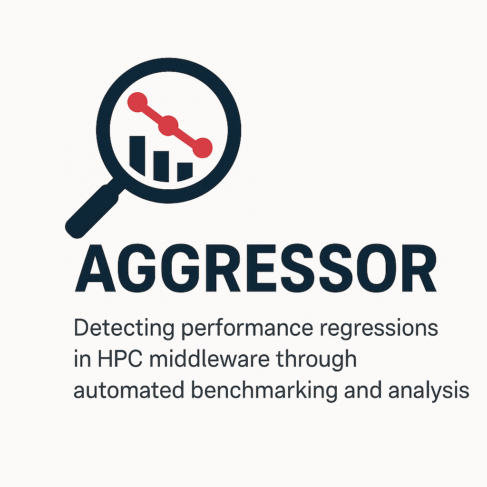

# HPC Performance Monitor



A Python service for detecting performance regressions in HPC middleware through automated benchmarking and analysis.

## Features

- **Git Integration**: Automated checkout and building of specific commits
- **Flexible Benchmarking**: Support for various HPC benchmarks with configurable parameters
- **Slurm Support**: Run benchmarks locally or through Slurm job scheduler
- **Comprehensive Analysis**: Statistical analysis of performance metrics with regression detection
- **Rich Reporting**: Generate reports in Markdown, HTML, or JSON formats
- **AI-Powered Diff Analysis**: Analyze code diffs using AI to identify potential performance issues

## Requirements

- Python 3.10 or later
- Git
- MPI implementation (e.g., OpenMPI, MPICH)
- Slurm (optional, for cluster deployment)
- CUDA/ROCm (optional, for GPU support)

## Installation

### Quick Install

1. Clone the repository:
   ```bash
   git clone https://github.com/ikryukov/aggressor.git
   cd aggressor
   ```

2. Install using pip:
   ```bash
   pip install -e .
   ```

### Development Setup

We use `uv` for fast and reliable Python package management. Here's how to set up your development environment:

1. Install uv (if not already installed):
   ```bash
   # On Linux/macOS
   curl -LsSf https://astral.sh/uv/install.sh | sh

   # On Windows
   powershell -c "irm https://astral.sh/uv/install.ps1 | iex"
   ```

2. Create a virtual environment:
   ```bash
   uv venv
   source .venv/bin/activate  # On Linux/macOS
   # or
   .\.venv\Scripts\activate  # On Windows
   ```

3. Install development dependencies:
   ```bash
   uv pip install -e .
   ```

### Development Tools

The project uses modern Python development tools:

- **Ruff**: For linting and code formatting
  ```bash
  uv pip install ruff
  ruff check .
  ruff format .
  ```

- **MyPy**: For static type checking
  ```bash
  uv pip install mypy
  mypy .
  ```

- **Pytest**: For testing
  ```bash
  uv pip install pytest pytest-cov
  pytest
  ```

### Keeping Dependencies Updated

To update dependencies to their latest compatible versions:
```bash
uv pip compile pyproject.toml --upgrade
uv pip sync requirements.txt
```

## Configuration

Create a YAML configuration file (see `config.example.yaml` for a template) with the following sections:

- **Git Repository**: URL and commit information
- **Build Settings**: Configure flags, make options, and environment variables
- **Benchmarks**: List of benchmarks with their parameters
- **Regression Analysis**: Thresholds and metric weights
- **Report Formats**: Multiple output format selection

Example:
```yaml
repo_url: "https://github.com/openucx/ucc.git"
work_dir: "/tmp/hpc-perf-monitor"
ref_commit: "master"
test_commits:
  - "HEAD~1"
  - "HEAD"

build:
  source_dir: "/tmp/hpc-perf-monitor/source"
  build_dir: "/tmp/hpc-perf-monitor/build"
  configure_flags:
    - "--enable-debug"
    - "--with-cuda=/usr/local/cuda"
  # ... more settings ...

  - name: "osu_bcast"
    type: "osu"
    benchmark_dir: "/home/ilya/work/hpcx/ompi/tests/osu-micro-benchmarks/"
    command: "osu_bcast -i 100000 --full"
    params:
      num_processes: [2]
      procs_per_node: [1]
      memory_types: ["host"]
    parser: "osu_bench"
    metrics: ["latency_max"] # important metrics

report_formats:
  - "markdown"
  - "html"
```

## Usage

Run the performance analysis:
```bash
python -m hpc_perf_monitor run-analysis ./config.yaml
```

Run the regression analysis:
```bash
python -m hpc_perf_monitor run-bisect ./config.yaml 809b1ccd4f1b70c0ba8a8aaf5cf6823ed1ff288e 4376c438bb43ff5d4151bf1182fa7a7c289946b8
```

Analyze a commit diff using AI:
```bash
python -m hpc_perf_monitor ai-diff /path/to/repo --commit HEAD --api-key YOUR_API_KEY
```

Options:
- `--output-dir`: Directory to store results (default: `results`)
- `--debug`: Enable debug logging
- `--api-key`: OpenAI API key (can also be set via OPENAI_API_KEY environment variable)
- `--api-base-url`: Custom API base URL (default: https://integrate.api.nvidia.com/v1)
- `--model`: AI model to use (default: nvdev/meta/llama-3.1-70b-instruct)
- `--output-file`: File to save analysis results
- `--system-prompt`: Custom system prompt for the AI analysis

## Report Formats

### Markdown
- Simple text-based format
- Great for version control and GitHub integration
- Easy to read and edit

### HTML
- Rich interactive format
- Includes styling and formatting
- Ideal for sharing with stakeholders

### JSON
- Machine-readable format
- Suitable for further processing
- Can be integrated into CI/CD pipelines

## Extending the Tool

### Adding New Benchmarks
1. Create a new benchmark configuration in your YAML file
2. Implement a parser for the benchmark output
3. Register the parser in the plugin system

### Custom Metrics
1. Add new metric definitions to your configuration
2. Update the regression analysis thresholds
3. Modify the report templates if needed

## AI-Powered Diff Analysis

The HPC Performance Monitor includes AI-based diff analysis to help identify potential performance issues in code changes:

### Features
- **Commit Analysis**: Analyze individual commit diffs for performance impacts
- **Custom Prompts**: Define your own analysis focus with custom system prompts
- **Output Options**: View results in the console or save to files

### Example

```python
from hpc_perf_monitor import AIDiffAnalysisConfig, AIDiffAnalyzer

# Configure the analyzer
config = AIDiffAnalysisConfig(
    api_key="YOUR_API_KEY",
    api_base_url="https://integrate.api.nvidia.com/v1",
    model="nvdev/meta/llama-3.1-70b-instruct",
    output_file="analysis_results.txt"
)

# Create the analyzer
analyzer = AIDiffAnalyzer(config)

# Analyze a specific commit
result = await analyzer.analyze_commit("./repo", "HEAD")
print(result.analysis)
```

See the `examples/analyze_diff.py` script for more detailed examples.

## Contributing

1. Fork the repository
2. Create a feature branch
3. Make your changes
4. Submit a pull request

## License

This project is licensed under the MIT License - see the LICENSE file for details.